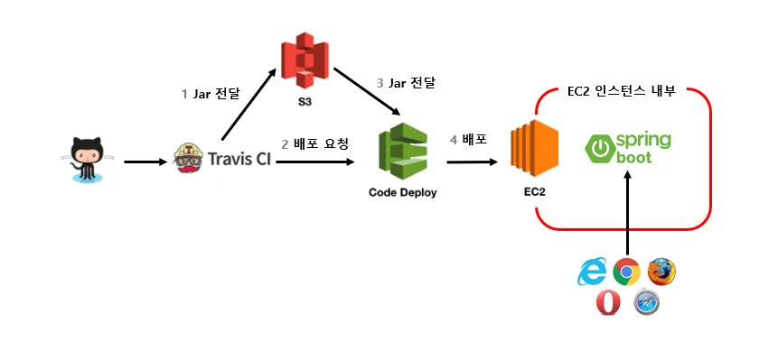
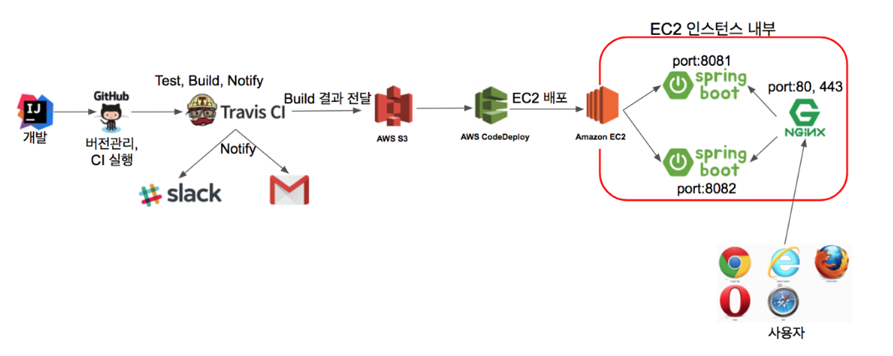

# springboot2-website

## 개요
이동욱님이 쓰신 "스프링 부트와 AWS로 혼자 구현하는 웹 서비스" 책을 따라 개발을 진행합니다.

## 변경사항
도서의 개발환경 버전이 옛날입니다.(개발에는 1년도 옛날..)   
해당 프로젝트에서는 옛날 버전에 맞추지 않고 최신버전을 그대로 이용하겠습니다.   
변경된 버전은 다음과 같이 기재합니다.
- spring-boot 2.5.2
- gradle4.x -> gradle-7.1.1
- jdk8 -> jdk11
- JUnit4 -> JUnit5
- AWS
  - Amazon Linux 1 -> Amazon Linux 2

## note
### chapter 3. 스프링 부트에서 JPA로 데이터베이스 다뤄보자
- Entity는 setter를 만들지 않는다. 목적과 의도를 확실히 구분한 메소드를 만든다.
- @Entity 어노테이션은 테이블과 연결되는 클래스를 나타낸다. 카멜케이스이름을 언더스코어 네이밍으로 테이블 이름을 매칭한다.
- lombok annotation은 필수가 아니라서 클래스명과 멀리 둔다. 그러면 kotlin으로 변경해도 쉽게 삭제가 가능하다.
- @ID == PK
- Entity 클래스와 Repository 클래스는 함께 움직여야하므로 도메인 패키지에서 함께 관리한다.
- applicatoin.properites 파일에 spring.jpa.show_sql=true 을 작성하면 실행되는 쿼리로그를 확인할 수 있다.
- h2 db를 MySQL 쿼리 형식으로 사용하려면 application.properties 파일에 아래처럼 추가해야한다. 버전이 달라서 아래 내용을 적용해야한다.
```PROPERTIES
spring.jpa.properties.hibernate.dialect=org.hibernate.dialect.MySQL57Dialect
spring.jpa.properties.hibernate.dialect.storage_engine=innodb
spring.datasource.hikari.jdbc-url=jdbc:h2:mem://localhost/~/testdb;MODE=MYSQL
```

- spring web 계층
- 
  - Web Layer
    - 외부 요청과 응답에 대한 전반적인 영역
    - 컨트롤러, JSP/Freemaker 등의 뷰 템플릿 영역
    - 필터(@Filter), 인터셉터, 컨트롤러 어드바이스(@ControllerAdvice) 등
  - Service Layer
    - @Service에 사용되는 서비스 영역
    - controller와 Dao의 중간 영역
    - @Transaction이 사용되어야 하는 영역
  - Repository Layer
    - database에 접근하는 영역
  - Dtos
    - Dto(Data Transfer Object)는 계층 간에 데이터 교환을 위한 객체
  - Domain Model
    - 도메인이라 불리는 개발 대상을 모든 사람이 동일한 관점에서 이해할 수 있고 공유할 수 있도록 단순화시킨 것을 도메인 모델이라고 함
- 비즈니스 처리는 Domain에서 담당해야한다.
- 서비스 메소드는 트랜젝션과 도메인 간의 순서만 보장
- 로직은 도메인 내부에서 처리 됨

- Date/Calendar 보다는 LocalDate, LocalDateTime을 사용을 권장
- JPA Auditing : Audit는 감독하고 검사하다는 뜻으로, 해당 데이터를 보고 있다가 생성 또는 수정이 발생하면 자동으로 값을 넣어주는 기능
- @MappedSuperclass 는 enitiy가 해당 클래스를 상속할 경우 필드들도 column으로 인식하도록 함
- @EntityListeners(AuditingEntityListener.class) 는 해당 클래스에 Auditing 기능을 포함 시킨다

### chapter 4. 머스테치로 화면 구성하기
- @Transactional 어노테이션에 readOnly = true 옵션을 주면 트랜잭션 범위는 유지하되 조회 기능만 남겨두기 때문에 속도가 빨라진다.

### chapter 5. 스프링 시큐리티와 OAuth2.0으로 로그인 기능 구현하기
- scope를 profile, email로 지정한다. 기본값은 openid, profile, email 인데 open id provider가 아닌 서비스를 위해서 별도로 OAuth2Service를 만들어야한다.<br>
하나의 OAuth2Service로 사용하기 위해서 일부러 openid scope를 빼고 등록한다.
```PROPERTIES
spring.security.oauth2.client.registration.google.scope=profile,email
```
- spring boot에서는 properties의 이름을 application-xxx.properties 로 만들면 xxx라는 이름의 profile이 생성되어 이를 통해 관리할 수 있다.
- spring security에서는 권한 코드에 항상 ROLE_이 앞에 있어야 한다.
- 세션 저장소로 톰캣, DB, 메모리 DB 가 있다.

### chapter 6. AWS 서버 환경을 만들어 보자 - AWS EC2
- [쉽게 EC2에 접속하는 방법](https://skagh.tistory.com/42)
- [EC2 필수 초기 설정](https://skagh.tistory.com/43)

### chapter 7. AWS에 데이터베이스 환경을 만들어보자 - AWS RDS
- [Maria DB 문자 인코딩 utf8mb4 변경 방법](https://skagh.tistory.com/44)

### chapter 8. EC2 서버에 프로젝트를 배포해보자
- [EC2 메모리 부족인 경우 SWAP으로 메모리 추가 할당하기 - AWS](https://aws.amazon.com/ko/premiumsupport/knowledge-center/ec2-memory-swap-file/)

### chapter 9. Travis CI 배포 자동화
- CI(Continuos Integration) : 개발된 코드를 테스트하여 배포파일을 생성하는 것을 자동화
- CD(Continuos Deployment) : 생성된 배포파일을 운영 서버에 배포하는 것을 자동화

- AWS S3에 배포파일을 보관하고 CodeDeploy로 배포하는 형태
- S3, CodeDeploy를 이용하려면 IAM 서비스를 이용해야함
- IAM의 역할은 AWS 서비스에, 사용자는 AWS 서비스 외에 사용할 수 있는 권한을 가짐
- codeDeploy log는 /opt/codedeploy-agent/deployment-root에서 확인가능

### chapter 10. 24일 365일 중단 없는 서비스를 만들자

- NginX의 리버스 프록시 기능을 이용한다.
- 리버스 프록시는 외부의 요청을 받아 백엔드 서버로 전달해주는 기능이다.
- 백엔드 서버 2개 중 최신 배포 서버를 연결하여 무중단 배포를 가능케한다.
- Amazon linux 2에서 nginx 설치 명령은 다음과 같다
```
sudo amazon-linux-extras install nginx1
```
- 배포할 경우 no main manifest attribute 문제가 발생할 수 있다.
  - build 파일 중 *-plain.jar 를 서버에서 실행시켜서 발생하는 문제
  - Spring Boot 2.5.0 부터 build하면 *-plain.jar 가 생성된다.
  - plain을 빌드되지 않도록한다.
  - plain archvies란?
      - spring으로 만든 일반적인 실행가능한 jar 파일에는 dependency가 포함되어있어서 java -jar 로 실행가능하다.
      - plain archvies는 이런 dependency가 없는 모듈의 class와 resource만 가지고 있는 jar이다.
      - Spring Boot's Gradle plugin 문서에서 자세히 확인 가능하다.
      - [document](https://docs.spring.io/spring-boot/docs/current/gradle-plugin/reference/htmlsingle/#packaging-executable.and-plain-archives)

## 독후감
- 하나의 웹 서비스를 처음부터 끝까지 경험해볼수 있는 책이다.
- spring boot로 개발하는 내용을 배울 수 잇어서 좋았다.
  - 개발할 때 폴더 구조는 다른 example을 보고 따라했는데 본 도서에서는 평소 알던 구조와는 다른 구조지만 그 이유를 말해줘서 좋았다.
  - 스프링 시큐리티로 oauth2.0 로그인 구현을 배울 수 있어서 좋았다.
- 배포 과정을 배울 수 있어서 좋았다.
  - AWS의 EC2, S3, RDS, code-deploy 사용 방법을 배울 수 있어서 좋았다.
- chapter11에 1인 개발을 위한 글은 가볍게 읽을 수 있지만 어느 챕터보다 중요한 글이라서 좋았다.
- 책이 서비스 구축 과정을 처음부터(기획제외) 배포까지 전체적으로 다루다 보니 하나를 깊게 다루지 않는다.
- 개발자라해도 서비스를 최초에 구축하는 과정을 경험하는 일이 많지않다. 그리고 책에서도 하나의 분야를 깊게 파지 이렇게 얕고 넓게 다루는 도서가 잘 없다.<br>실제 사용될 서비스를 구축한 것은 아니지만 책을 따라가면서 이런 느낌으로 현업에서도 웹서비스가 구축되고 활용되는구나 라는 인사이트를 얻을 수 있다.
- 본 도서 저자가 출연하는 유투브 [개발바닥](https://www.youtube.com/channel/UCSEOUzkGNCT_29EU_vnBYjg/featured)에서 동영상을 함께 보면 개발자에 대한 마인드도 함께 배울 수 있다.
  - 개발자로서의 자세와 같은 더 넓은 관점에서 좋은 정보를 얻을 수 있다.
- 개발환경을 최신버전으로 적용하면서 발생하는 오류를 디버깅하면서 각 부분을 그냥 따라할때보단 깊게 이해할 수 있었다.
### 웹서비스 구축 프로세스를 접해볼 수 있는 책 🔥🔥